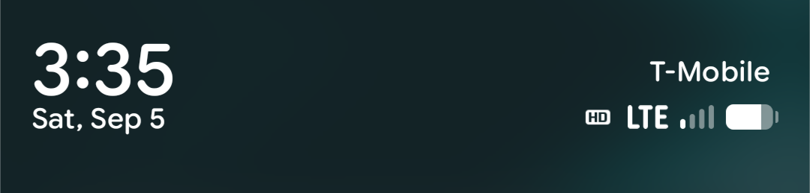
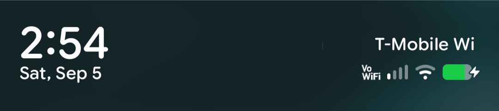

# LG V60: VoLTE + VoWiFi on LineageOS

VoLTE (Voice over LTE) and VoWiFi (Wi‑Fi Calling) for the **LG V60 ThinQ** (`timelm`) running
**LineageOS 23.x**, delivered as one small `system_ext` overlay image plus two Magisk modules.

LineageOS ships no IMS/MmTel stack for the V60, so out of the box calls only work over 2G/3G
circuit‑switched (or LTE CSFB). This project ports the V60's own LG IMS stack forward, wires it
to the LineageOS telephony framework, and adds the strongSwan/ePDG path for Wi‑Fi Calling.

<table>
<tr>
<td>VoLTE registered (cellular), LG "HD" indicator</td>
<td></td>
</tr>
<tr>
<td>VoWiFi registered: "T‑Mobile Wi‑Fi Calling", "VoWiFi" indicator</td>
<td></td>
</tr>
</table>

`ipsec stroke statusall` with Wi‑Fi Calling active:

```
slot0_ims[1]: ESTABLISHED, 192.168.1.x[<imsi-nai>@nai.epc.mncNNN.mccMMM.3gppnetwork.org]
              ...<epdg-ip>[epdg.epc.mncNNN.mccMMM.pub.3gppnetwork.org]
slot0_ims[1]: IKE proposal: AES_CBC_128/AES_XCBC_96/PRF_AES128_XCBC/MODP_2048
slot0_ims{1}: AES_CBC_128/AES_XCBC_96, <bytes> bytes_i, <bytes> bytes_o, rekeying in NN minutes
```

---

## Quick start (prebuilt, specific LineageOS nightlies)

Each release attaches a prebuilt `lg_substrate.img` so you can try this without building
anything. **The substrate matches exactly one LineageOS nightly** (its SELinux policy and
framework coupling are version‑specific); the modules are version‑independent.

| Release | `lg_substrate.img` matches |
|---|---|
| [`v0.2`](https://github.com/greatluke/lgv60-ims-volte-vowifi-lineageos/releases/tag/v0.2) | `lineage-23.2-20260906-nightly-timelm` |
| [`v0.1`](https://github.com/greatluke/lgv60-ims-volte-vowifi-lineageos/releases/tag/v0.1) | `lineage-23.2-20260830-nightly-timelm` |

1. Install the matching LineageOS nightly and Magisk. Confirm the build number in
   Settings → About.
2. Download `lg_substrate.img`, `v60_ims_volte.zip`, `v60_vowifi.zip` from that release and
   verify the checksums (`sha256sum -c SHA256SUMS`).
3. Follow **Install**, below. Nothing to build.

On any other LineageOS build, build the substrate yourself from your own firmware:
[`docs/BUILDING.md`](docs/BUILDING.md). The two module zips work on any same‑branch build.

---

## What it contains

| Component | Role |
|---|---|
| **`lg_substrate.img`** | A LineageOS stock `system_ext` image with the LG IMS/ePDG substrate grafted in: the LG SELinux policy closure (`system_ext_sepolicy.cil` plus the four `*_contexts` files), three LG `init` service definitions, seven native daemons (`lge_ims_phone_provider`, `imsipsec*`, `ipsecd`, `starter`, `charon`, `ipsec`), seven `lib64` `.so`, and `/etc/ipsec/`. These are consumed by `init`/`secilc` before Magisk loads, so they cannot be a module. |
| **`v60_ims_volte`** (Magisk module) | The LG IMS application layer: `com.lge.ims` (Ims6) with a status‑bar VoLTE indicator fix, the LG data service with a small compatibility stub, LG framework jars, the `seinfo=platform` mapping for the local signing key, the `seapp`/`property` context overlays (rebuilt from the live ROM at install), a boot service that enables the LG data service and selects `com.lge.ims`, and a `telephony-common.jar` overlay that clears a rejected-while-ringing incoming call out of Telecom. **This alone gives you VoLTE.** |
| **`v60_vowifi`** (Magisk module) | Adds Wi‑Fi Calling on top: the ABI‑fixed strongSwan `stroke` client, an `ipsecd` binary patch for a vendor HAL that LineageOS does not carry, the `ipsecd`/`charon` SELinux grants, the AOSP `com.android.qns` plus `com.google.android.iwlan` packages (repackaged and re‑signed, with two crash fixes and a permission added), `andsf.xml`, and a boot service that applies the CarrierConfig WLAN‑service routing override via `cmd phone cc`. **Requires `v60_ims_volte`.** |

Everything the modules bundle from the LG firmware or from a Google/Pixel build is
**proprietary and is not distributed here.** You build the image and the modules yourself from
your own LG V60 stock firmware and a LineageOS `system_ext.img`. See
[`docs/BUILDING.md`](docs/BUILDING.md).

---

## Requirements

- LG V60 ThinQ (`timelm`) with an **unlocked bootloader**, running LineageOS 23.x.
- **Magisk** installed (root).
- The three artifacts: from the [v0.1 release](https://github.com/greatluke/lgv60-ims-volte-vowifi-lineageos/releases)
  if you are on build `20260830`, otherwise built yourself (see
  [`docs/BUILDING.md`](docs/BUILDING.md)).

---

## Install

1. **Flash the substrate image** (fastbootd):

   ```sh
   adb reboot fastboot
   fastboot getvar is-userspace      # must be: yes
   fastboot flash system_ext lg_substrate.img
   ```

   Reboot.

2. **Install `v60_ims_volte`** in the Magisk app → reboot.
   VoLTE registers automatically. Verify:

   ```sh
   adb shell su -c 'dumpsys activity service com.android.phone | grep MmTelCapab'
   # MmTel Capabilities - [Voice: true Video: true ...]
   ```

   Place a call. The LG "HD" indicator appears and the call is over LTE.

3. **Install `v60_vowifi`** in the Magisk app → **enable "Wi‑Fi Calling"** in
   Settings → Network & internet → SIMs → reboot.

   Connect to Wi‑Fi. The tunnel comes up automatically; if it doesn't within a minute, toggle
   Wi‑Fi off/on once. Verify:

   ```sh
   adb shell su -c '/system_ext/bin/stroke statusall'          # slot0_ims[1]: ESTABLISHED
   adb shell su -c 'dumpsys activity service com.android.phone | grep imsTransportType'
   # imsTransportType=WLAN
   ```

   The carrier name shows "… Wi‑Fi Calling" and the "VoWiFi" status‑bar indicator appears.

### Updating LineageOS

The LG substrate is tied to the LineageOS `system_ext` version. Each release's prebuilt image
matches one nightly (v0.1 → 20260830, v0.2 → 20260906); for any other build, rebuild and
re‑flash `lg_substrate.img`
([`docs/BUILDING.md`](docs/BUILDING.md) → "After a LineageOS update"). The two Magisk modules
carry across untouched, which is why later releases publish just the modules.

---

## Carrier support

Validated on **T‑Mobile US**. The design is mostly carrier‑neutral, but:

| Piece | Carrier dependency |
|---|---|
| ePDG address + IMS identity (NAI) | Derived from your IMSI automatically (`epdg.epc.mncNNN.mccMMM.pub.3gppnetwork.org`); no change needed |
| `tools/andsf.xml` | Contains a home PLMN (`310240`). Change the MCC/MNC to your carrier's |
| CarrierConfig override (applied at boot) | The WLAN service‑routing keys are carrier‑agnostic; it also sets `carrier_volte_available_bool` / `carrier_wfc_ims_available_bool` and drops IKE integrity algorithm `5` (which this IKE library rejects). Adjust the algorithm set if your ePDG needs something else. |
| VoLTE APN / ISIM | Handled by the modem's own carrier configuration |
| **VoWiFi entitlement provisioning** | T‑Mobile does not require it. **AT&T, Verizon and many EU carriers require an entitlement‑server check that this project does not implement.** Wi‑Fi Calling will likely not register on those |

Rule of thumb: **VoLTE** should work on any carrier the V60 modem supports; **VoWiFi** should
work on carriers that don't gate it behind entitlement provisioning, after editing
`andsf.xml`'s PLMN.

---

## Docs

- [`docs/BUILDING.md`](docs/BUILDING.md): build the image and the two modules from your own
  firmware; rebuilding after a LineageOS update.
- [`docs/PATCH-RECIPES.md`](docs/PATCH-RECIPES.md): exact steps to reproduce each patched
  binary/APK.
- [`docs/FINDINGS.md`](docs/FINDINGS.md): why the pieces are split the way they are; the
  non‑obvious blockers and how each was resolved.

## Credits & licensing

Scripts and documentation: Apache‑2.0 (see `LICENSE`).
The built image and modules bundle LG‑proprietary firmware components and AOSP/Google
packages that are **not** covered by that license and are **not** distributed here (see
`NOTICE`). Uses [strongSwan](https://strongswan.org/) (GPLv2), [LineageOS](https://lineageos.org/),
and AOSP.

## Support

Weeks of reverse engineering went into this. If it got Wi‑Fi Calling working on your V60 and
you'd like to say thanks:

<a href="https://buymeacoffee.com/greatluke"></a>
